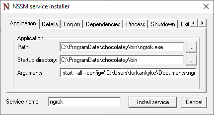
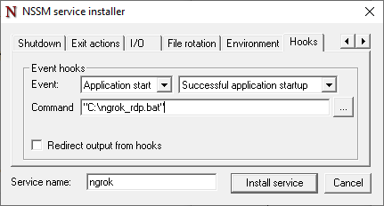

# Run ngrok as windows service and send it's ip to a discord channel
## Installing requirements
### Chocolatey package manager
- Open power shell and enter code below to install chocolatey package manager 
```powershell
Set-ExecutionPolicy Bypass -Scope Process -Force; [System.Net.ServicePointManager]::SecurityProtocol = [System.Net.ServicePointManager]::SecurityProtocol -bor 3072; iex ((New-Object System.Net.WebClient).DownloadString('https://community.chocolatey.org/install.ps1'))
```

### Ngrok
```powershell
choco install ngrok
```

### Non-Sucking Service Manager 
```powershell
choco install nssm
```

### Jq command-line JSON processor
```powershell
choco install jq
```

### Curl 
```powershell
choco install curl
```

- Register [Ngrok](www.ngrok.com) and get auth token from dashboard
- Edit Ngrok auth token with yours in build_ngrok_config_file.bat
- [How to create a Discord Hook](https://support.discord.com/hc/en-us/articles/228383668-Intro-to-Webhooks)
- Edit discord hook variable with yours at ngrok_rdp.bat 

### Build ngrok and install ngrok service 
```powershell
build_ngrok_config_file.bat
nssm install ngrok
```


- find your config location with ```$env:LOCALAPPDATA\ngrok\ngrok.yml```
- find ngrok location with ```where ngrok```
- fill application and application startup path respective to location of ngrok
- set application parameters to  "start --all --config="YOUR_NGROK_CONFIG_FILE""


- Go to hooks tab set event as Application Start and Successful application startup
- Set command as path of ngrok_rdp.bat
- Finally install service by click on Install Service button
- Open a brand new administrator powershell and type code bellow to start service
```powershell
sc start ngrok
```
